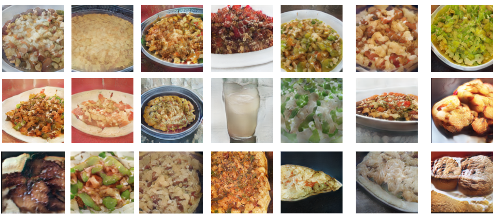
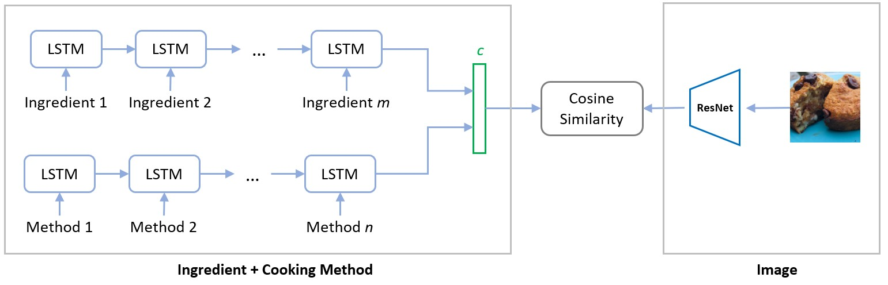
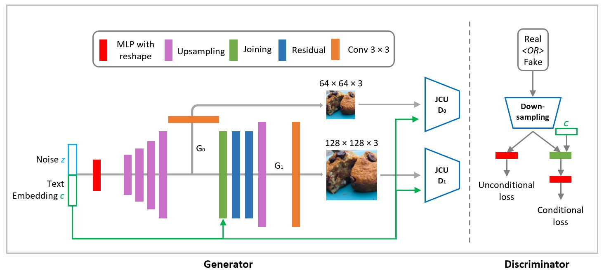

# Food Generation From Ingredients and Cooking Method
## Team
**Team name**: 0 error, 0 warning

**Team members**: Hanyuan Xiao, Kaijie Cai, Buke Ao, Heng Zhang

  

## Motivation
Food image generation as one of image generation tasks is useful in visualization for almost everyone. Given food ingredients and cooking methods (e.g. bake, grill), people may wonder name and image of the dish that can be cooked. For example, chefs may want to try so many new ingredients and cooking method to invent new menu. Parents may be worried about whether dinner will be attractive to their children and consider nutrients at the same time. Based on the same ingredients, can we make something new and interesting? Even students who have a deadline may want to spend the minimum time to cook their lunch or dinner with whatever in the fridge. Therefore, such an image generator can provide a high-level idea about what they can cook. 

Besides sparks and interest that can be brought to the public in this project, outputs of our model can also be used to evaluate and quantify vital criteria of food with attention drawn by Computational food analysis (CFA) [0] such as meal preference forecasting, and computational meal preparation. Therefore, the model defines its importance and usage in real life and is crucial to human life. Existing approaches such as The Art of Food do not take cooking method as input. However, the importance has been overshadowed since the same ingredients can be made into different dishes. For instance, chicken and noodles can be made in ramen or fried noodles by boiling and stir-fry, respectively. Therefore, this project aims at developing a reliable method to generate food image that fits in any specific class.

## Problem Statement
For this project, we trained a deep learning network to learn and generate food images with ingredients and cooking methods as input. Typically, we leveraged Generative Adversarial Network (GAN) for our task.

## Related Works & Method
### Related Works
Objects in Images have many attributes which could represent the visual information. On the other hand, those attributes could be described by texts. So if the connection between images and texts are learned, we could generate images by texts. Furthermore, there are two steps to solve this problem, first is to learn the text feature representation that related to the key visual details and the second is to generate an image from the text feature representation that fulfill the attributes described by words.

The connection between image pixel and text description is highly multimodal, there are many possible mapping relations between them. The key problem in this multimodal learning is to find the shared representation across different modalities and could generalize the rules to unseen data.

One way to generate images from texts is implemented by coding the texts into class labels, which may lose information and inaccurate. Instead of directly use class labels, [1] proposes an end-to-end architecture to generate images from text encoding by RNN and GAN. In this report, we use two stages of association model and generative model to address this problem.

### Method
To address this problem, we use a recipe association model which could find the common representations (embeddings) between image and text ingredients, and then use a GAN to generate images from the embeddings

  

The loss function of association model is:

=\mathop{\mathbb{E}}_{\hat{p}(r^+,v^+),\hat{p}(v^-)}min([cos[\textbf{p}^+,\textbf{q}^+]-cos[\textbf{p}^+,\textbf{q}^-]-\epsilon],0)\newline\hphantom{asdfasdfsadf}+\mathop{\mathbb{E}}_{\hat{p}(r^+,v^+),\hat{p}(r^-)}min([cos[\textbf{p}^+,\textbf{q}^+]-cos[\textbf{p}^-,\textbf{q}^+]-\epsilon],0)),

where ) is positive pair between ingredient embeddings and image embeddings. ), ) are negative paris.  is the bias to train the model on pairs not correctly associated.

This model takes ingredients and cooking method as text inputs, and uses images as inputs of another side. The ingredients and cooking methods are encoded by LSTM and then are concatenated together get the representation embedding of texts. The embeddings of images are generated by ResNet and then fine-tuned by our dataset. Finally a cosine similarity is used as the loss function. The LSTM has XXX hidden units and XXX layers. We trained the model XXX epoches to get a final loss of XXX. 

  

We first get the text embeddings from the ingredients by the trained LSTM networks in the association model.  The text embeddings are then used as the condition codes in our stackGAN. In order to ascertain the food image has the ingredients it depends, a cycle-consisitency term is added to make the similarity between the fake images and text embeddings of ingredients strong.

The overall loss function of image generation by GAN is:

+\lambda_{ca}L_{ca})

In the equation, the loss of generator both conditioned and unconditioned are considered. The loss of cycle-consistency constraint is also incorporated and the last part is the regularization to make the probability of conditions given image embeddings approximates to standard Gaussian  

## Experiment
### Dataset
We conduct our experiments using data from recipe1M [4]. The recipe1M dataset consists of more than 1 million food images with corresponding ingredients and instructions. We manually chose 12 different types of cooking method that we think are meaningful and distinguishable, and generated cooking method for each image by searching for keywords in the instruction text. We also reduced the number of different ingredients from around 18,000 to around 2,000 by removing ingredients with low frequency ( < 500 occurrence in the dataset)  and combining ingredients that are the same or very close.  Because of the limit of time and computing resources we used only 10,000 data from the dataset.

### Input
We feed association model with paired and unpaired 128 &#215; 128 image and words. For the stackgan model, we use both 64 &#215; 64 and 128 &#215; 128 images because there are two discriminators differential two resolution images from generators.

## Evaluation
<table>
   <tr>
      <td></td>
      <td></td>
      <td></td>
      <td>im2rcp</td>
      <td></td>
      <td></td>
      <td></td>
      <td>rcp2im</td>
      <td></td><td></td>
   </tr>
   <tr>
      <td></td>
      <td></td>
      <td>MedR&#8595;</td>
      <td>R@1&#8593;</td>
      <td>R@5&#8593;</td>
      <td>R@10&#8593;</td>
      <td>MedR&#8595;</td>
      <td>R@1&#8593;</td>
      <td>R@5&#8593;</td>
      <td>R@10&#8593;</td>
   </tr>
   <tr>
      <td>1K</td>
      <td>model in [1]</td>
      <td>5.500</td>
      <td>0.234</td>
      <td>0.503</td>
      <td>0.618</td>
      <td>5.750</td>
      <td>0.230</td>
      <td>0.491</td>
      <td>0.615</td>
   </tr>
   <tr>
      <td></td>
      <td>our model</td>
      <td><b>4.400</b></td>
      <td><b>0.261</b></td>
      <td><b>0.549</b></td>
      <td><b>0.679</b></td>
      <td><b>4.200</b></td>
      <td><b>0.270</b></td>
      <td><b>0.556</b></td>
      <td><b>0.682</b></td>
   </tr>
   <tr>
      <td>5K</td>
      <td>model in [1]</td>
      <td>24.000</td>
      <td>0.099</td>
      <td>0.265</td>
      <td>0.364</td>
      <td>25.100</td>
      <td>0.097</td>
      <td>0.259</td>
      <td>0.357</td>
   </tr>
   <tr>
      <td></td>
      <td>our model</td>
      <td><b>17.900</b></td>
      <td><b>0.116</b></td>
      <td><b>0.299</b></td>
      <td><b>0.406</b></td>
      <td><b>16.700</b></td>
      <td><b>0.129</b></td>
      <td><b>0.315</b></td>
      <td><b>0.421</b></td>
   </tr>
   <tr>
      <td>10K</td>
      <td>model in [1]</td>
      <td>47.000</td>
      <td>0.065</td>
      <td>0.185</td>
      <td>0.267</td>
      <td>48.300</td>
      <td>0.061</td>
      <td>0.178</td>
      <td>0.261</td>
   </tr>
   <tr>
      <td></td>
      <td>our model</td>
      <td><b>34.900</b></td>
      <td><b>0.077</b></td>
      <td><b>0.212</b></td>
      <td><b>0.301</b></td>
      <td><b>32.700</b></td>
      <td><b>0.088</b></td>
      <td><b>0.229</b></td>
      <td><b>0.319</b></td>
   </tr>
</table>

## Future Improvements
From the experiments, we find that there are some improvements can be made in the future. Firstly, reducing the number of ingredients further. For example, we may combine different kinds of cheeses as they have similar appearance and contribution to the generated images. Such change will reduce the redundancy in the dataset and make it easier to learn. Secondly, balancing the number of images with different color to prevent the model from the inclination to generate reddish and yellowish images. Finally, we may further investigate the way to better control the contribution of conditional inputs as we found that it sometimes generated irrelevant image. Attention mechanism and regularization loss can be the options.

## Contributions
We acknowledge the assistance and advice from professor [Joseph Lim](https://viterbi-web.usc.edu/~limjj/) and TAs of course CS-566 (Deep Learning and its Applications). With their guidance, we developed the project and made the following contributions.
* A conditional GAN model for food image generation task with ingredients and cooking methods as input
* A refined version of dataset Recipe1M which further contains cooking methods extracted from instructions
* Quantitative data that proves cooking method as a useful and valuable input to food image generation tasks

## References
[1] Reed, Scott, et al. "Generative adversarial text to image synthesis." arXiv preprint arXiv:1605.05396 (2016).
